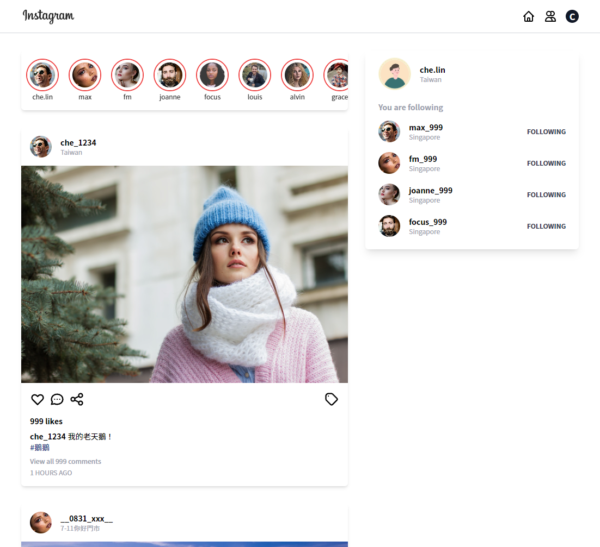

# React Instagram

使用 React 搭配 TypeScript、React Route 和 Redux 建置仿效 Instagram 的小專案。

## 包含的功能

- 貼文的渲染
- 追隨的功能

## 啟用步驟

1. 執行 `npm run server` 或 `yarn server` 啟用 mock server。
2. 執行 `npm run start` 啟動專案。
